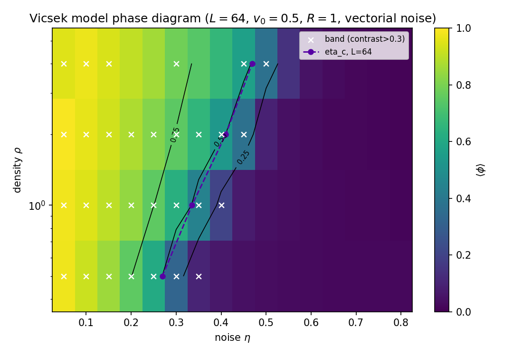
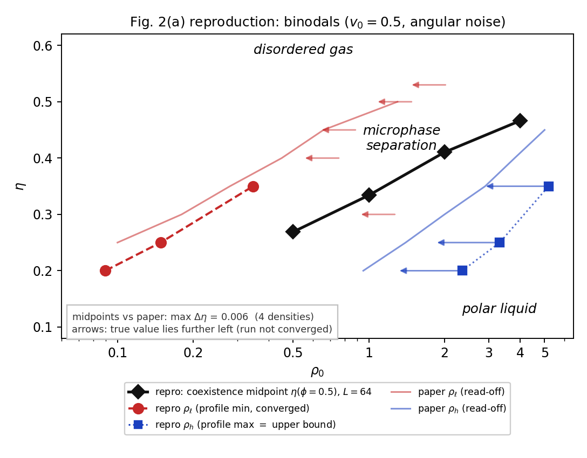
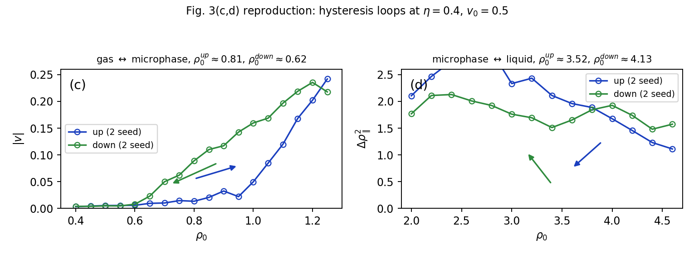
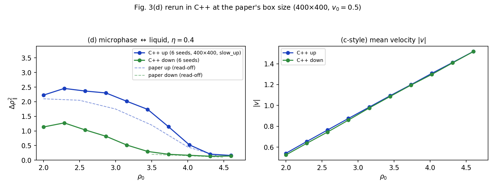
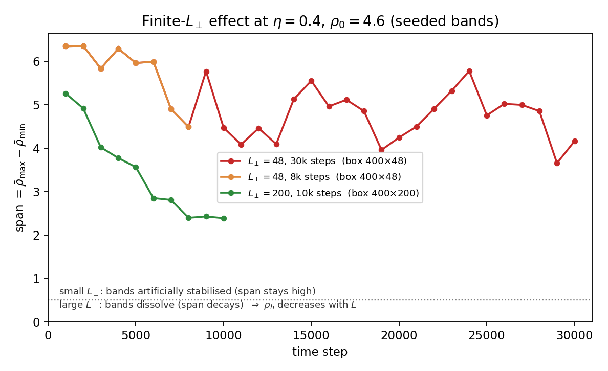
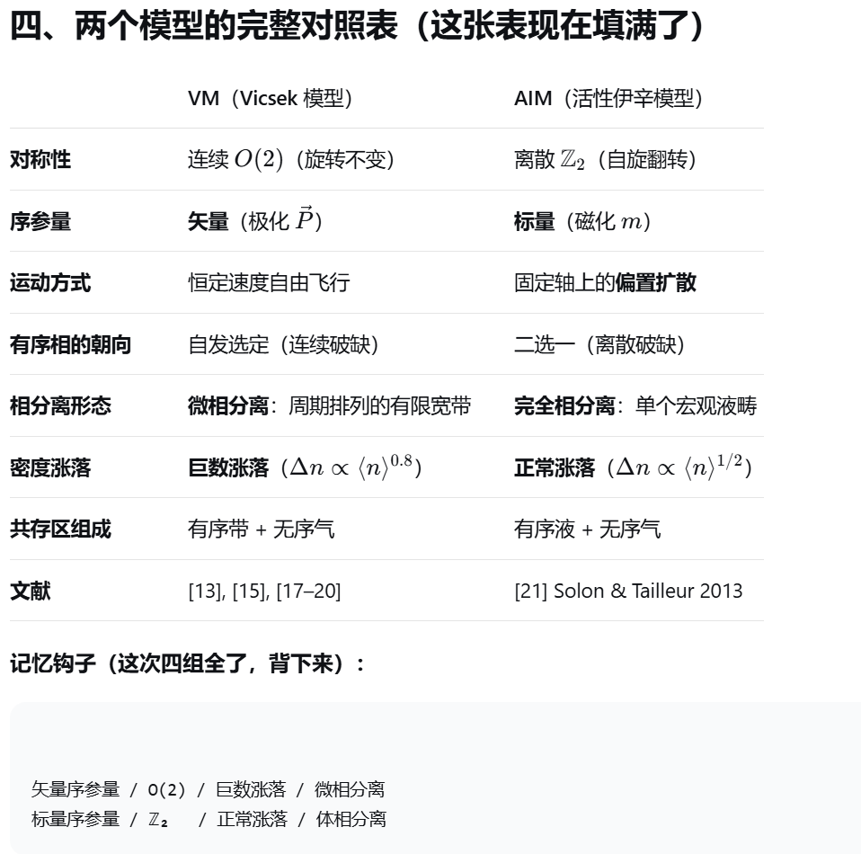
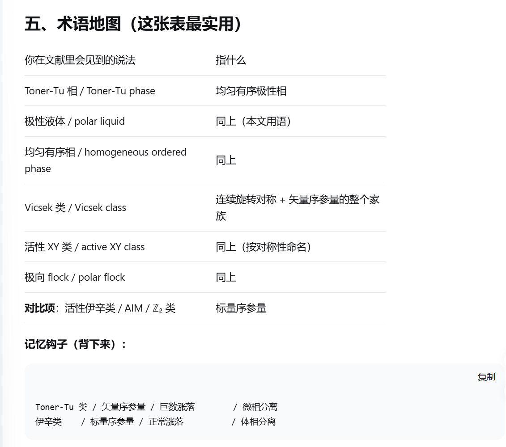
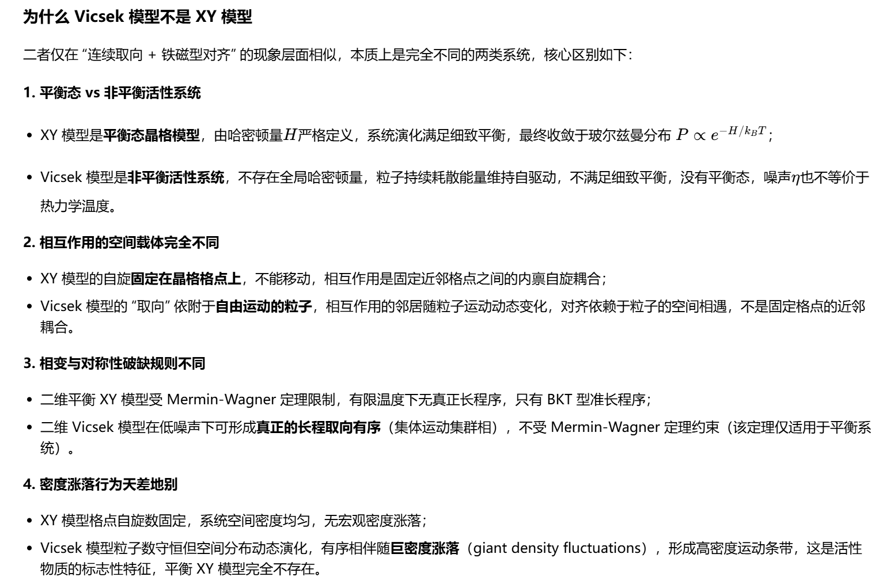

用自己写的代码，把 Solon、Chaté 与 Tailleur 在 <em>PRL</em> <strong>114</strong>, 068101 (2015) 里的相分离图像重算一遍。 
下面是模型、代码结构、复现结果，以及哪些地方还没有做到。

## 这个项目在做什么

那篇 PRL 的核心主张是：Vicsek 模型的"有序—无序转变"不是普通的连续相变，而是**一级相变 + 微相分离**。均匀有序相（Toner-Tu 相 / 极性液体）与无序气相之间隔着一段共存区，共存区里系统自发排成周期排列的有限宽"带"。

我把复现目标具体到三张图：

| 论文 panel | 内容 | 我的做法 |
|---|---|---|
| Fig 2(a) | binodal 相图：$\rho_\ell(\eta)$（气体侧）与 $\rho_h(\eta)$（液体侧） | 一次共存区长程运行，取带剖面的谷值与峰值 |
| Fig 3(c) | $\eta=0.4$ 下气体 ↔ 微相分离的滞后回线 | 密度 ramp，400×100，2 seeds |
| Fig 3(d) | $\eta=0.4$ 下微相分离 ↔ 极性液体的滞后回线 | 密度 ramp，400×400（C++），6 seeds |

**为什么重写代码**：这篇论文的相图对噪声约定、初态协议、盒子纵横比都很敏感。只有代码是自己写的，而且有两套独立实现互相对齐，才能确定复现的是论文里那条转变线，而不是一条形状相近的线。

## 模型

角噪声（scalar / angular noise）Vicsek 模型，对应论文式 (1)。所有粒子用 $t$ 时刻的信息**平行更新**：

$$
\theta_i(t+1)=\mathrm{Arg}\Big(\sum_{j\in S_i}\mathbf{v}_j(t)\Big)+\eta\,\xi_i,
\qquad
\mathbf{x}_i(t+1)=\mathbf{x}_i(t)+v_0\,\mathbf{e}_i(t+1)\pmod L
$$ {#eq-vicsek}

- $S_i$：与粒子 $i$ 距离 $\le R$ 的所有粒子（**含自身**），周期边界取最小镜像约定；
- $\xi_i$：$[-\pi,\pi]$ 上均匀分布的随机角，噪声幅值为 $\eta\pi$，$\eta\in[0,1]$；
- 标准参数：$v_0=0.5$、$R=1$、$\Delta t=1$；初态为随机位置 + 随机取向，也就是"从无序出发"。

### 先把术语说清楚：角噪声还是矢量噪声

同一篇文献里 "vectorial noise" 和 "angular noise" 经常被混着写，但它们是两个不同的模型。按 Ginelli & Chaté, *EPJ ST* **225**, 2099 (2016) 的定义：

- **scalar / angular noise**（其式 (2) 即本页式[@eq-vicsek]）：随机角 $\eta\xi_i$ 加在邻居速度**和的辐角**上；
- **vectorial noise**（其式 (6)）：随机矢量在归一化**之前**加到邻居速度**和**上，幅值正比于邻居数。

两者渐近性质相同，有限尺寸行为有差异，**定量对照文献数值时不能混用**。Solon–Chaté–Tailleur (2015) 的 Fig 2 / Fig 3 用的是角噪声版本，本项目的所有实现都与它对齐——这也是为什么下面的 $\eta$ 刻度可以和论文直接比。

## 代码结构：两代实现 + 一条并行分支

| 文件 | 属于 | 做什么 |
|---|---|---|
| `vicsek.py` | 第一代（方形盒） | 模型核心：精确邻域搜索、观测量、单点 CLI、自检 |
| `scan.py` | 第一代 | 并行网格扫描（多进程/线程、断点续跑、`--quick` / `--dense`） |
| `analyze.py` | 第一代 | 相图绘图 + $\eta_c$ 提取 |
| `vicsek_rect.py` | 第二代（矩形盒） | 加上任意 $L_\parallel\times L_\perp$ 与 `ramp_run` 密度 ramp 协议 |
| `vicsek_ramp.cpp` | 第二代（C++ 加速） | 与 `vicsek_rect.ramp_run` **同一物理、同一协议**的编译实现 |
| `campaign.py` | 复现流水线 | 批量跑 Fig 2(a) / Fig 3(c,d) 的任务 |
| `plot_cpp_fig3d.py` | 复现流水线 | 出 Fig 3(d) 的 C++ 对照图 |

这条线是**两代**：方形盒的相图扫描 → 矩形盒加 ramp 协议 → 把第二代编译成 C++ 去跑论文规格的 400×400。C++ 版不是新模型，它和 Python 版在同一批用例上 $\varphi$ 相差 0.2%–0.9%。

**另外还有一条并行分支**：`sim/` 目录里有一套从头独立写的带测量工具（`vicsek_bands.cpp`，Python/scipy 版 205 ms/步已弃用）。它只做一件事——测共存区里一条带的宽度与密度，回答"噪声降低时一条带的质量为什么变小"。它不是第三代，而是一套**独立写的第二实现**，用来对主线的结论做交叉验证：两套代码在 $\eta=0.4$、$\rho=1.93$、800×100 下给出 $\varphi$ 差 **0.7%**、$n_b$ 同为 6。

## 复现结果

### 相图中的点对上了

用 $L=64$ 方形盒、随机初态扫描每个密度的 $\varphi=0.5$ 中点，与论文相图两条曲线的窗口中点对比：

| $\rho_0$ | 我的 $\eta(\varphi=0.5)$ | 论文窗口 | 论文中点 |
|---|---|---|---|
| 0.5 | 0.270 | (0.12, 0.43) | 0.275 |
| 1.0 | 0.335 | (0.21, 0.47) | 0.340 |
| 2.0 | 0.410 | (0.30, 0.52) | 0.410 |
| 4.0 | 0.470 | (0.41, 0.53) | 0.470 |

**四个密度全部吻合到 0.01 以内**。这条对齐同时确认了三件事：模型写对了、噪声约定选对了（角噪声而非矢量噪声）、$\eta$ 的标度可以直接和论文比较。

{#fig-phase fig-alt="相图热力图与转变线"}

### 与论文 Fig 2(a) 的对照

{#fig-fig2a fig-alt="复现相图与论文 Fig 2(a) 的对照"}

气体侧 $\rho_\ell(\eta)$ 在 $\eta\le0.35$ 收敛得很好（$\eta=0.20$：0.089；$\eta=0.25$：0.148；$\eta=0.35$：0.31–0.44）。$\eta\ge0.4$ 的点系统性偏高 20–40%，原因是气体背景在给定步数内还没有完全稀释：趋势对，数值没到平衡。具体原因列在下面「复现到什么程度」一节。

### 滞后回线：气体 ↔ 微相分离（Fig 3(c)）

$\eta=0.4$，400×100，2 seeds：

| 量 | 复现 | 论文（400×400，100 runs） |
|---|---|---|
| 上行支成核 $\rho_0$ | 0.81–0.95 | 0.90 |
| 下行支消失 $\rho_0$ | 0.62–0.70 | 0.75 |
| $\lvert v\rvert$（$\rho_0=1.25$） | 0.24 | 0.23 |

两支的相对位置、弯曲形状、右端汇合都与论文截图一致；滞后略宽，来自 seeds 数与 $L_\perp$ 的差异。

{#fig-fig3cd fig-alt="气体与微相分离之间的滞后回线"}

### 滞后回线：微相分离 ↔ 极性液体（Fig 3(d)）

这一张最初是失败的：在 400×48 的窄盒子里，上行支无论如何都不崩塌，看起来像"$\rho_h>5.5$"。换成论文规格 400×400、每点 8000 步、上行用 3 条带种子、6 seeds 之后：

| $\rho_0$ | 上行支 $\Delta\rho_\parallel^2$ | 下行支 | 论文读数 |
|---|---|---|---|
| 2.00 | $2.23\pm0.04$ | 1.14 | ~2.1 |
| 2.87 | $2.30\pm0.11$ | 0.82 | ~2.1 |
| 3.44 | $1.74\pm0.17$ | 0.30 | ~1.9 |
| 4.02 | $0.52\pm0.15$ | 0.17 | ~1.2 |
| 4.60 | $0.16\pm0.05$ | 0.14 | ~0.15 |

上行支平台 2.2–2.45（论文 2.1）、高密度端 0.16（论文 0.15）、下行支高密度侧 0.13–0.20（论文 ~0.15）——**高密度端和平台都对上了**。仍然存在的差异：我的崩塌区在 3.7–4.0，比论文（4.0–4.2）偏早，而且崩塌过程比论文**更平缓**（论文是在 4.0 附近陡降）。

{#fig-fig3d fig-alt="微相分离与极性液体之间的滞后回线"}

### 液体侧 binodal：为什么不能用剖面峰值

最开始的做法是错的：把带剖面的峰值当作 $\rho_h$。小 $L_\perp$ 盒子里带被挤压，峰值会系统性偏高约一倍（$\eta=0.2$ 给 2.35，论文约 0.95；$\eta=0.35$ 给 5.19，论文约 2.9）。

换用带稳定性判据、并做 $L_\perp$ 扫描后，证据链才清楚：

| 盒子 | span 演化（30000 步内） | 判定 |
|---|---|---|
| 400×48 | 6.35 → 4.16，无趋势（均值 5.03） | 不溶解——窄盒子人为稳定带 |
| 400×200 | 5.26 → 3.56 → 2.39 单调衰减 | 正在溶解 |
| 400×400（C++ ramp） | 下行支 $\rho\ge3.7$ 时 $\Delta\rho_\parallel^2=0.14$–0.18 | 已均匀 |

{#fig-rhoh fig-alt="不同横向盒宽下带密度的演化"}

## 一个教训：协议本身是结果的一部分

同一个状态点（$\eta=0.4$、$\rho_0=2.87$），三种协议给出三个差别很大的 $\Delta\rho_\parallel^2$：

| 上行支协议 | $\rho_0=2.87$ 处的 $\Delta\rho_\parallel^2$ | 现象 |
|---|---|---|
| 每点 4000 步、播 2 条带 | 3.56 | 带被压缩（还没弛豫），偏高 |
| 每点 8000 步、播 3 条带 | **2.30** | 与论文的 2.1 吻合 |
| 单点充分弛豫（3000+ 步自由演化） | 1.24 | 带展宽、气体密度升到 1.65，偏低 |

**太快 → 带被压缩、偏高；太慢 → 带展宽、偏低**；论文的 2.1 落在中间，对应"ramp 足够慢，让带数能随密度自己调整"。所以播种的带数应该按自然带数取：

$$
n_b=\frac{L_\parallel\,(\rho_0-\rho_{\rm gas})}{\mu}
$$ {#eq-band}

否则带会被盒子挤住。论文自己也提醒过这一点。上面那个 $\rho_h>5.5$ 的假象也是同一个原因：参数没错，是盒子太小。

## 复现到什么程度

已经站得住的：

- 相图中点：四个密度的 $\eta(\varphi=0.5)$ 与论文窗口吻合到 **0.01 以内**；
- Fig 3(c)：跃变位置与幅度在 0.05–0.1 以内；
- Fig 3(d)：上行支平台、高密度端、下行支高密度侧都对上；
- 带态定量：$\eta=0.40$、$\rho_0=1.93$、800×100 下 $\rho_{\rm gas}=0.622$（论文 0.606，差 2.6%）、峰值 4.82（论文 $\approx4.5$）、$n_b=6$（论文 $\approx6$）；自洽检查 $L_x(\rho_0-\rho_{\rm gas})/n_b=174.4$ 与实测的 $m_b/L_\perp=174.4$ 完全一致；
- 三个相区、两条 binodal 的形状、带的共存机制、双向滞后——**定性全部复现**。

还没做到的：

| 现象 | 原因 | 需要什么 |
|---|---|---|
| $\rho_\ell(\eta\ge0.4)$ 偏高 20–40% | 气体背景未完全稀释（共 9000–25000 步不够） | 瞬态 ×3–5 |
| Fig 3(d) 上行支崩塌偏平缓 | ramp 偏快 + $L_\perp=48$ 稳定带 | 每点弛豫 ×5（约 4000 步）+ 更大 $L_\perp$ |
| 下行支低密度端 1.1–1.3（论文 ~2.1） | 成核在给定步数内没有完全展开 | 更多步数 |
| 滞后宽度偏大 | 2 seeds（论文 100 runs） | 更多 seeds、更慢 ramp |
| Fig 2(a) 蓝线没有独立测量 | 需要更慢 ramp / 更大 $L_\perp$ | 慢 ramp + 恢复 $L_\perp$ |

**根本约束**：论文 Fig 3(c,d) 用 400×400 盒子 + 100 runs，我这边是 16 核、纯 NumPy（没有 GPU，也没装 numba）。把 400×400 跑到收敛大约要 17 小时一条 ramp，所以对 $L_\perp$ 和步数做了缩减——这直接导致高密度支没有到平衡。上面每一条"还没做到"，原因都是算力，不是物理。

## 工程侧：从 516 ms/步 到 33.6 ms/步

要在论文规格盒子上跑，Python 就不够了。400×400（$N=736\,000$）时同规模 NumPy 约 5.5 s/步（候选对数 $3.1\times10^7$），一条 23k 步的 ramp 要 35 小时。C++ 版最终 **33.6 ms/步**（16 线程），约 **160×**，同一条 ramp 约 13 分钟。

| 优化 | 效果 |
|---|---|
| SoA + `float`：位置与取向分开存，内存流量减半 | 基础 |
| **强制内联取整**：`nearbyintf` / `floorf` 在热循环里退化为 libm 调用 | **12.8×**（4 线程 744 → 58 ms/步） |
| **计数排序按单元重排**：邻居循环从随机散布访存变成连续内存，可预取 | 与上项合计约 4.6×（16 线程 156 → 33.6 ms/步） |
| sin/cos 查表（4096 项 + 线性插值，误差约 $10^{-7}$） | 同上 |
| `std::thread` 按粒子分块（每粒子只写自己的槽位，无竞争）+ OpenMP 处理 $O(N)$ 循环 | 16 核近线性 |
| 邻居单元 LUT、每线程独立 xoshiro256 随机数 | 基础 |

两个值得记下来的坑：

1. **libm 调用**：`std::nearbyintf` / `std::floorf` 没被内联时是真正的函数调用，内层每对候选粒子调 2 次，即 6600 万次/步——正好解释了实测的 1.03 s/步。
2. **自己写的查表 bug**：把 `ang×NB/(2π)` 当作"圈数比例"之后又乘了一次 `NB`，等效把噪声角放大 6.28 倍，任意 $\eta>0$ 都变成随机旋转。发现它的线索很干净：$\eta=0$ 的极限测试给出 $\varphi=1.0000$ 且所有粒子指向 $+x$，这是"零邻居回退分支"的特征签名。

Python 那条线也踩了两个值得写的坑：

- **排序后"朝向 ↔ 位置"错配**：一开始把状态存成 $\theta$，在单元计数排序**之前**算好 $(\cos\theta,\sin\theta)$，排序之后却用新槽位去索引旧顺序的三角函数值 → 张冠李戴。改成直接以 $(\cos\theta,\sin\theta)$ 为状态量、scatter 时和位置一起搬运、永不重算，$\varphi$ 立刻对上参考值。
- **初态的取向展宽是要害**：随机位置 + 随机朝向跑 12000 步 → 塌成一个巨团（峰值 $\rho\approx19$）；按 6 条带密度播种但朝向随机 → 照样塌；只有"按 6 条带播种 + 朝向近似对齐（spread $=0.1\pi$）"才稳定成 6 条带。**带的形成有明确的成核/弛豫门槛**，这正好呼应论文里的"临界核"与 Fig 3(c) 的滞回环。

还有一条协议层面的：**跨 $\eta$ 比较时不能配平"过剩密度"，必须配平"液相比"**（杠杆定则）：

$$
\varphi_{\rm liq}=\frac{\rho_0-\rho_\ell}{\rho_h-\rho_\ell}=\text{const}
$$ {#eq-lever}

用 $\varphi_{\rm liq}=0.39$ 从相图反解出正确的取样密度（$\eta=0.40\to\rho_0=1.92$、$\eta=0.35\to1.34$、$\eta=0.30\to0.91$）。在这之前我按"$\rho_0/\rho_h$ 差不多"取样，结果落在共存窗口之外——第一波样本整体作废。

## 背景：这个模型在文献地图里的位置

复现的过程也是补背景的过程。下面几张是我读文献时整理的对照表。

{#fig-aim fig-alt="平衡伊辛模型与 AIM 的性质对照表"}

{#fig-vsaim fig-alt="Vicsek 模型与 AIM 的对称性、序参量、相分离形态对照表"}

{#fig-terms fig-alt="Toner-Tu 相、极性液体、Vicsek 类、活性 XY 类等术语对照表"}

{#fig-notxy fig-alt="Vicsek 模型与 XY 模型的四点本质区别"}

关键的一条：**Vicsek 模型和 XY 模型只是"连续取向 + 铁磁对齐"这层现象相似，本质上是两类系统**。XY 是平衡态晶格模型，受 Mermin–Wagner 定理约束；Vicsek 是非平衡活性系统，粒子自由飞行、邻居随运动而变，不受该定理约束，而且它的有序相伴随**巨数密度涨落**（$\Delta n\propto\langle n\rangle^{0.8}$）——形成高密度带正是这种涨落的表现，平衡 XY 模型里完全不存在。

也正因为如此，Vicsek 类模型（矢量序参量、$O(2)$、巨数涨落、微相分离）和对面的活性伊辛类 AIM（标量序参量、$\mathbb{Z}_2$、正常涨落、体相分离）在相分离形态上完全不同：前者是**周期排列的有限宽带**，后者是**单个宏观液畴**。

## 下一步

1. **慢 ramp**：每密度点 4000–6000 步（而不是 1200），$\mathrm{d}\rho$ 减半，预估 8–12 小时/条；
2. **恢复 $L_\perp$**：至少 100，高密度端再考虑 200–400；
3. **多 seeds**：每条 ramp 5–10 个种子，消掉分支噪声；
4. **补上带速 $c$ 的独立测量**（现在用的圆互相关够用但不够稳）；
5. **可选加速**：装 numba（Python 3.13 需 ≥0.61）把步进循环编译，预期再快 5–10 倍。

## 代码与文献

**代码**：本页对着的源码都在仓库的 `projects/vicsek-model/code/` 下（`vicsek.py`、`vicsek_rect.py`、`scan.py`、`analyze.py`、`vicsek_ramp.cpp`、`campaign.py`、`plot_cpp_fig3d.py`），目录说明见同目录的 `README.md`。

**文献**：

- Solon, Chaté & Tailleur, *From Phase to Microphase Separation in Flocking Models: The Essential Role of Nonequilibrium Fluctuations*, **PRL 114**, 068101 (2015) —— 复现目标。
- Ginelli & Chaté, *Relevance of metric-free interactions in flocking phenomena*, **EPJ ST 225**, 2099 (2016) —— 角噪声 / 矢量噪声的术语定义出处。

论文全文与截图仅用于本地阅读与对照，不在本站转载。

<a class="section-link" href="../index.html">← 返回 Projects</a>

